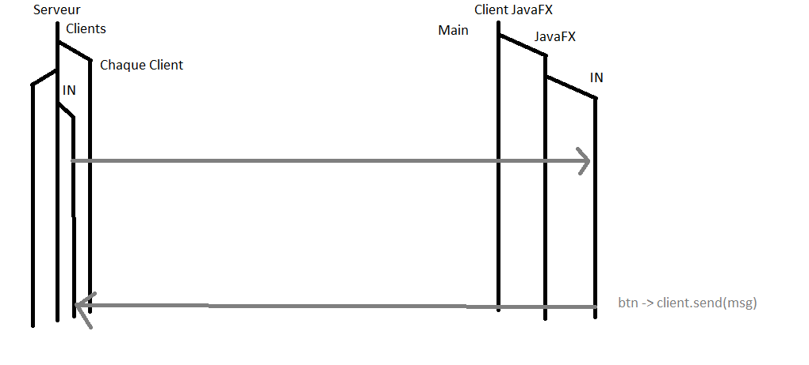
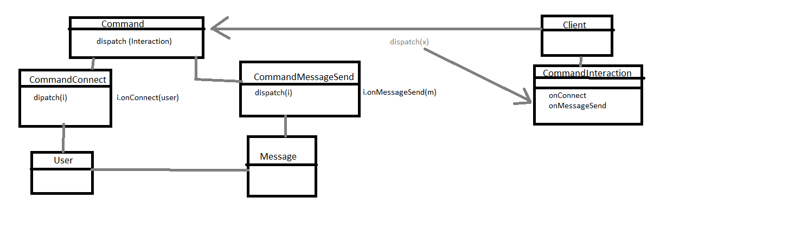

# Transfert d'objets sur le réseau 
Pour transférer un objet sur le réseau en Java, il est impératif que l'objet envoyé soit identique des deux côtés du réseau (la même classe)
Nous pouvons donc faire un module commun qui permettra de partager les classes communes entre différents modules

# Threading

## Serveur
Il nous faut d'abord une liste de clients côté serveur. On aura un thread pour écouter et un pour écrire.

## Client
Nous avons notre thread main, notre thread pour le javaFX, un autre thread pour l'écoute. Tous les changements visuels doivent être faits dans le thread JavaFX.

Nous avons `Platform.runLater(<lambda>);` on lui donne un code et une fois que nous serons dans le thread JavaFX, le code sera effectué.

