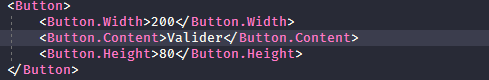
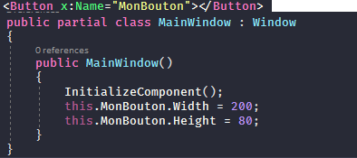
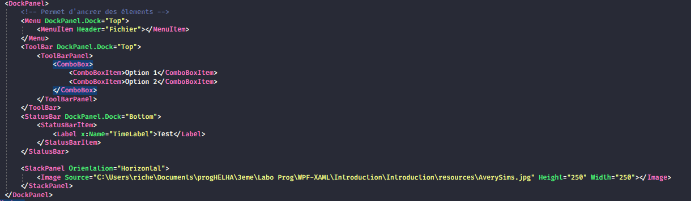
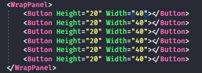
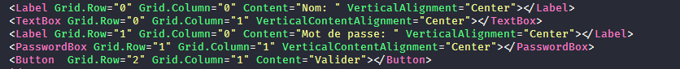
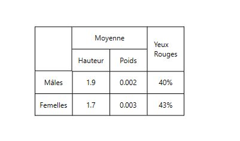

# WPF & XAML

- Couche métier et présentation de winForms était trop proche et les gens étaient mécontents.
Ressources graphiques étaient créées niveau code, iGPU n'était pas (ou très peu) utilisé.

- Ce qui était sympa avec winForms -> travail d'une app Web et desktop exactement pareil (niveau code / graphique).

- Utilisation de WPF & XAML pour remplacer windows Forms.

## Avantage de WPF

On peut dire que UWP est le succésseur du WPF et ce dernier est le succésseur du winForms.

### Unification de l'UI

### Moteur de rendu de vue vectoriel

Intéressant dans le cas des problèmes d'accessibilités par exemple pour les mal voyants (pas de perte de qualité et de déformation).

### WPF utilise le GPU

Afin d'effectuer les calculs nécessaires pour les ressources graphiques.

### Utilisation d'unité logique

`1/96 de pouce` -> unité logique, si l'on augmente la résolution de l'écran, l'UI garde la même taille.

### WPF sépare la partie visuelle de l'UI.

## Présentation de XAML

__XAML__ = Extensible Avalon Markup Language -> `Extensible Application Markup Language`.

On le prononce _zammel_.

XAML est un langage de balises pour la programmation d'applications.

## XAML

- Le XAML est propre à la couche présentation.
- Un fichier XAML est un fichier XML ( /!\ fermeture de balises)
- Peut-être codé en UTF-8, UTF-16 ou ASCII.
- Présente au moins deux espaces de noms.


L'environnement graphique est associé à la même classe. On peut donc intéragir de façon dynamique en code :


## Container Window

- En HTML les balises doivent être en minuscules, Microsoft décide de mettre des majuscules à la première lettre de leurs balises.

### Conteneur unique

- Dans le conteneur Window, on devra choisir un conteneur unique pour mettre en forme notre page.

Pour commencer le design, on peut soit _drag and drop_ un objet de la `toolbox` dans le designer, ou alors de créer directement les balises en code.


- Si l'on ne définit pas de largeur et hauteur à un bouton, il prendra toute la place de l'interface.

- Si l'on fige la hauteur / largeur d'un bouton, ça risque de ne pas marcher si l'on a une résolution plus petite que celle du bouton.



- On peut mettre les attributs dans le composant, ce qui nous permettra d'avoir une meilleure lisibilité.

Les attributs sont déclarés comme des __chaines de caractères__ mais sont convertis automatiquement (pour les types simples) dans le type qui est requis (dans le cas de la hauteur d'un bouton, le `String` est converti en `double`).



On peut déclarer un bouton en XAML et ensuite le manipuler dans le code.


## Contrôles de placement

### Canvas Panel -> graphiques 2D.

Les enfants sont positionnées en utilisant des coordonnées explicites. Les coordonnées peuvent être définis par rapport à un côté du panneau en utilisant les propriétes ( `Canvas.Top`, `Canvas.Left`, `Canvas.Right`, `Canvas.Bottom`).

On peut dessiner des ronds, des carrés, etc dans ce panneau.

### Stack Panel -> remplis de façon horizontal ou vertical.

Permet d'empiler les éléments enfant les uns en desssous des autres ou les uns à côté des autres suivant l'orientation qui aura été définie.

```xml
<StackPanel Orientation="Vertical">
        <Border BorderThickness="2" BorderBrush="Blue" Margin="1">
            <StackPanel Margin="10" Orientation="Horizontal">
                <Image Width="100" Source="C:\images\photo.jpg"></Image>
                <Label VerticalAlignment="Center" FontSize="20">Dubart François</Label>
            </StackPanel>
        </Border>
        <Border BorderThickness="2" BorderBrush="Blue" Margin="1">
            <StackPanel Margin="10" Orientation="Horizontal">
                <Image Width="100" Source="C:\images\photo.jpg"></Image>
                <Label VerticalAlignment="Center" FontSize="20">Dujardin Eric</Label>
            </StackPanel>
        </Border>
    </StackPanel>

```


Voici l'exemple d'un formulaire de login en utilisant des _Stack Panel_


### Dock Panel -> Pour ancrer des composants à un endroit.

Panneau d'ancrage, on peut ancrer un élement sur le haut, la gauche, la droite ou le bas du panneau grâce à un attribut `DockPanel.left`.



### Wrap Panel

Similaire au _Stack Panel_ à l'exception que les élements sont placés sur une seule ligne.



### Grid Panel -> La grille, constitutée de cellules.

On doit définir au niveau de la grid, le nombre de lignes, le nombre de colonnes. 
Ensuite, on peut utiliser __Grid.Column__ et __Grid.Row__ pour déplacer un élement dans la grid.

Voici comment déclarer des colonnes et des lignes: 


On pourra donc utiliser des élements comme suit:




Le code est disponible dans le projet _Introduction_ dans la fenêtre __ArrayGridExercice.xaml__

### Text Block

On peut utiliser un text block pour _Wrapper_ un texte et donc permettre le saut de ligne dans un tableau.

### Status Bar

- Barre d'état
- Contient des StatusBarItem.

### TextBox

- Permet l'entrée / sortie de donnée.

### ToolBar

- ToolBarPanel
- On peut mettre dedans, par exemple, une ComboBox

### Menu

- Permet de faire un menu
- Contiendra des MenuItem -> propriété Header pour lui assigner un texte.