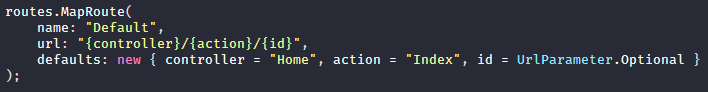

Quant on enverra une requête à notre application web, on la divisera comme il est décrit dans le fichier "App_start/RouteConfig.cs"

Par défaut la vue retournée est du même nom que la méthode qui l'appelle.

- Quand on crée un contrôleur, un dossier portant le nom _primaire_ (<b><i>Home</i></b>Controller) du contrôleur est ajouté dans le dossier _Views_.

## Ajout de CSS

- Quand on ajoute une feuille de style, pour optimiser la lisibilité du projet, on va ajouter un dossier nommé _"Stylesheet"_ et ajouter dedans nos feuilles de style.