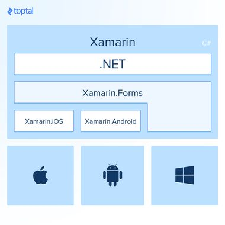

# Cours Xamarin

## Le marché

* Deux grands acteurs sur le marché:

    - Apple avec les iPhone et iPad et son os iOS.
    - Google et son OS Android utilisé par de nombreux fabricants.

* Chaque plateforme apportent leurs propres caractéristiques.

    - Façon de naviguer entre les apps et pages.
    - Convention différente de représenter les données.
    - Façon différente d'appeler et d'afficher les menus.
    - Gestion différente du touché.

* Les environnements de développement

    - Pour le développement iOS, Xcode sur Mac.
    - Pour le développement Android, Android Studio.
    - Pour le développement WinPhone, Visual Studio.

* Les interfaces de prog sont différentes, elles ont des noms différents. 

    ex: toggle d'un booléen:

        - iOS view appelée UISwitch
        - Android Widget appelé Switch
        - Windows Control appelé ToggleSwitch

* Langage de programmation

    - iOS : Objective-C / Swift
    - Android : Java
    - Windows : C#

Solution = avoir trois équipes de développeur spécialisés sur chaque plateforme.

## C# et technologie .NET

- Microsoft donne naissance à sa technologie en 2000.
- Framework 1.0 est associé le langage C# dans sa version 1.0.
    -> Car le runtime compiler est compatible avec la version du langage dans lequel il a été créé.
- Version Visual Studio .NET 2002 intègre le C#.

Framework .NET n'existe que dans l'environnement Microsoft. Bien que C# est normalisé.

## Projets de portabilité

- En 2000, Ximian lance un projet open source appelé Mono afin de créer une implémentation du compilateur C# et du .NET Framework sous Linux.
- En 2003, Ximian est rachetée par Novell.
- En 2011, Novelle est rachetée par Attachmate et la société Xamarin voit le jour. Mono forme la base d'une solution mobile Cross-Platform.
- En 2016, Microsoft rachète Xamarin et Xamarin.Forms est maintenant gratuitement sur Visual Studio.

* Xamarin a trois librairies:
    - Xamarin.Mac (venant de MonoMac)
    - Xamarin.iOS (venant de MonoTouch)
    - Xamarin.Android (venant de MonoDroid)

- VS permet sans restriction de pouvoir dév des apps sous Android
- Pour le dév iOS :
    - Avoir un mac avec macOS.
    - AvoirXCode.
    - Effectuer un pairage avec Visual Studio Windows et le mac.
    
    L'émulation sera possible que sous ces conditions.

## Cross-platform et MVVM

* Les != entre plateformes résident dans l'aspect graphique.
* Le traitement des données reste en général indépendant de la plateforme.
* L'utilisation du MVVM est donc conseillée dans ce type de développement.
* Le code indépendant peut être placé dans un projet séparé soit Shared Asset Project (SAP) ou Portable Class Library (PCL) sous forme de DLL.

__Du bas vers le haut:__
    
    * Les API natives.
    * Les librairies Xamarin pour la plateforme visée.
    * L'interface utilisateur.
    * Le code partagé.

 

## Xamarin Compiler

- Pour iOS, le compilateur Xamarin génère un code dans un langage intermédiaire qui est ensuite compilé par le compilateur Apple.
- Pour Android, Xamarin compile dans un langage interprété qui sera exécuté par la version Mono installée sur le périphérique.

## Exécution

On peut exécuter notre application Xamarin sur un téléphone physique ou alors via un émulateur. Un émulateur est bien dans le cas où l'on veut vérifier la rétrocompatibilité 

## Test

Tester une app sur iPhone physique est moins simple que pour Android. Le Free Provisioning permet aux dévs Xamarin.iOS de déployer et tester leurs apps sur des appareils iOS sans faire partie du programme du dev Apple. /!\ Le certificat a une durée de validité de 6 jours.

Pour lier notre mac à notre visual studio sous windows, nosu pouvons rentrer les identifiants Apple dans les paramètres > Xamarin > Apple accounts

## Prerealase

Attention aux prereleases lors des projets, cela peut poser des soucis